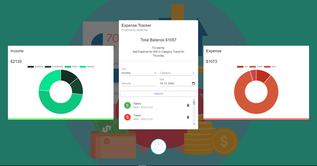

# Voice-Recognized-Expense-Tracker

Voice recognized expense tracker is a react application developed by me for a hackathon recently held at my university. It is a react application which helps people to keep a record of their monthly expenses with the added support of a speech recognition assistant which helps in filling the expense details. I have used HTML/CSS, Javascript and ReactJS. I have integrated Speechly for Speech Recognition feature. The application works as the react application opens and then we will be able enter our expense details by filling the details and we will be able to see the data as Pie Charts which will be easy for people to visualize their income and expenses. People with less knowledge of computers and the internet can also use this to maintain a record of their income and expenses which is the prime motive. People with lesser knowledge will easily come to webApp and enter the required details and It will be stored in the local storage.  I'll be adding different investment options in future to help people with investments with the money they saved. 
<p>
Tech Stack:
HTML
CSS
ReactJS
Javascript
Context API
Material UI
</p>


Setup:
- run ```npm i && npm start```
     
Open [http://localhost:3000](http://localhost:3000) to view it in the browser.

<p>
  
</p> 


